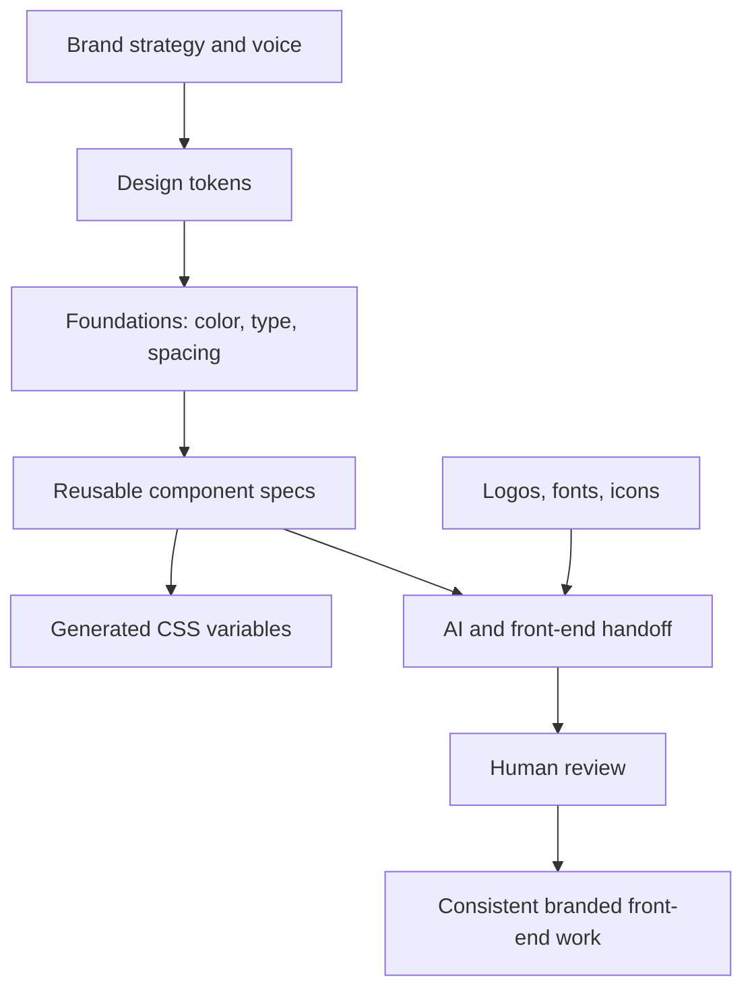
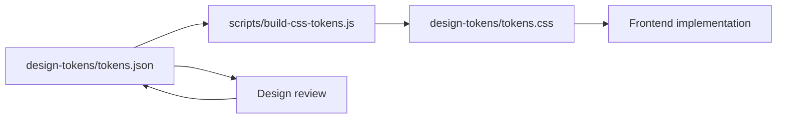

# Brand Design System Starter

A portable starter system for translating brand context into usable design tokens, foundations, components, and AI-assisted front-end handoff.

This repo is a standalone starter system. It is not a migration of the older `brand-design-system/` folder that still exists inside the profile README repo. That older folder is retained as an archived reference. This repo uses its own starter palette and structure so the public source of truth is explicit rather than implied.

## What this repo is

This is not a full production design system. It is a lightweight, portable starter kit for building one.

It gives a team or AI agent enough structure to move from brand direction to repeatable front-end implementation without starting from a blank page.

The goal is simple: make brand execution more consistent, reusable, and reviewable.

## Canonical source of truth

For this repo, the canonical source of truth is:

- `design-tokens/tokens.json` for token values and token metadata
- `design-tokens/tokens.css` for generated CSS custom properties
- `foundations/` for usage guidance
- `components/` for component-level implementation guidance

The navy, amber, and teal palette in this repo is an example starter palette aligned to an editorial/operator identity. It should not be treated as the canonical token set for every Jared Silverman web property or for the older embedded profile-repo design-system folder.

## System flow

## Why this exists

AI-assisted design and front-end work fails when the context is vague.

A good prompt is not enough. The system needs:

- brand rules
- design tokens
- component expectations
- front-end conventions
- asset manifests
- review criteria
- reusable handoff notes

This repo packages those pieces into one place so collaborators and AI tools can produce more consistent work.

## How this fits into the Growth Architecture ecosystem

`brand-context-system` is the intake layer: it organizes raw brand inputs, Figma references, assets, web examples, and working notes.

`brand-design-system-starter` is the implementation layer: it turns that context into tokens, foundations, component guidance, CSS variables, and AI-ready front-end handoff.

Together, they show a repeatable tactic: convert scattered brand and design material into an operating system that humans and AI tools can use consistently.

## Repo map

| Path | Purpose |
|---|---|
| `design-tokens/` | Source tokens and generated CSS variables |
| `foundations/` | Brand foundations for color, type, spacing, accessibility, and layout |
| `components/` | Component-level specs for common UI patterns |
| `assets/` | Placeholder structure for logos, fonts, icons, and image assets |
| `scripts/` | Utility scripts for token generation and structure validation |
| `examples/` | Minimal token sample and component-spec pattern |
| `docs/` | Wiki copy, release notes, metadata, and implementation guidance |
| `CLAUDE.md` | AI handoff instructions for Claude or similar tools |
| `SECURITY.md` | Public-safe reporting and data-handling policy |

## Quick start

The repo can be used directly by reading the Markdown files and copying the token JSON/CSS patterns into another project. Local helper scripts are available for regenerating CSS variables from source tokens and validating the expected repo structure.

## Token workflow

## Example output

- [`design-tokens/tokens.css`](design-tokens/tokens.css) is the canonical generated CSS output.
- [`examples/example-token-output.css`](examples/example-token-output.css) is a minimal illustrative sample, not a duplicate of the generated file.
- [`examples/example-component-spec.md`](examples/example-component-spec.md) shows how component guidance should be written.

## What good looks like

A strong implementation should make it easy to answer:

- What colors, spacing, typography, and radius values should be used?
- Which tokens are semantic versus raw values?
- What does a button, card, hero, or form need to look and feel like?
- Which assets are approved?
- What should Claude or another AI tool inspect before generating code?
- What should a human reviewer check before shipping?

## Who this is for

This repo is useful for:

- growth leaders building landing-page systems
- designers translating brand direction into reusable UI language
- marketers using AI tools for design and front-end acceleration
- engineers needing lightweight brand implementation rules
- consultants packaging a client brand into a repeatable build system

## Related repos

This repo is part of a connected public system. See the [GitHub Ecosystem Map](https://github.com/silvermanjared-web/growth-architecture-os/blob/main/docs/ecosystem-map.md) for how the repos relate.

Shared terminology: [Common Language](https://github.com/silvermanjared-web/growth-architecture-os/blob/main/docs/common-language.md).

- [`growth-architecture-os`](https://github.com/silvermanjared-web/growth-architecture-os)
- [`brand-context-system`](https://github.com/silvermanjared-web/brand-context-system)

## Licensing and reuse

This repo is public for professional review and portfolio context. The package is intentionally marked `private` and `UNLICENSED`, which means it is not published as a package and is not offered as open-source software for reuse without permission.

Usage and rights: see [USAGE.md](USAGE.md).

## What this demonstrates

This repo shows a practical tactic I use often: turn scattered brand, design, and front-end context into a structured operating layer that can be reused by humans and AI tools.

It is not just storage. It is a system for making brand-consistent execution easier.