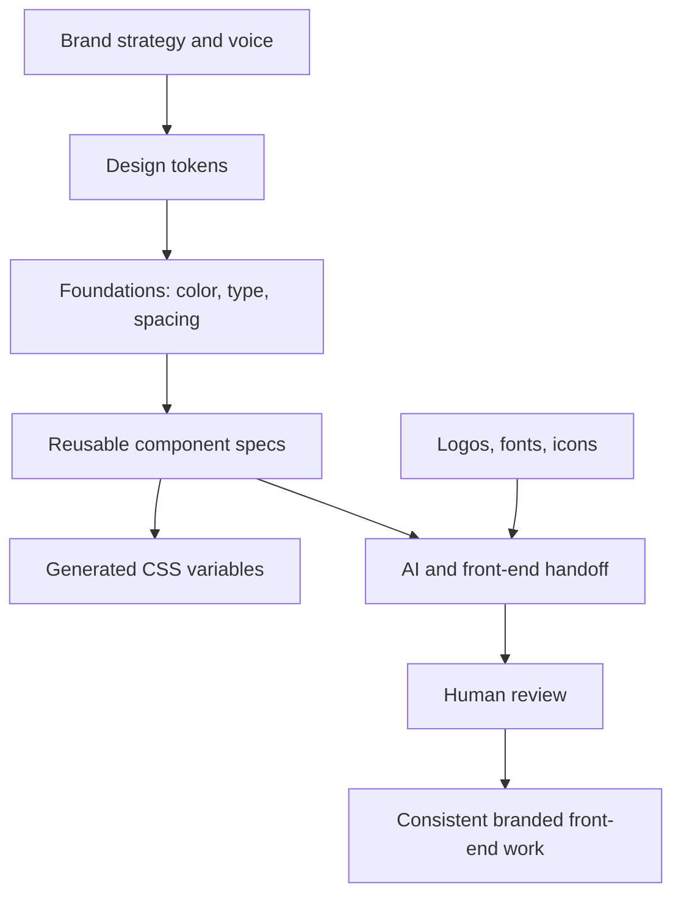
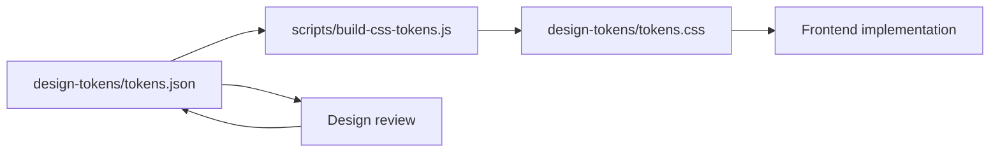

# Brand Design System Starter

A portable starter system for translating brand context into usable design tokens, foundations, components, and AI-assisted front-end handoff.

This repo is the polished design-system layer that was previously buried inside the profile repo. It is now structured as a standalone public asset: tokens, foundations, component specs, asset conventions, validation scripts, and Claude-ready handoff notes.

## What this repo is

This is not a full production design system. It is a lightweight, portable starter kit for building one.

It gives a team or AI agent enough structure to move from brand direction to repeatable front-end implementation without starting from a blank page.

The goal is simple: make brand execution more consistent, reusable, and reviewable.

## System flow



## Why this exists

AI-assisted design and front-end work fails when the context is vague.

A good prompt is not enough. The system needs:

- brand rules
- design tokens
- component expectations
- front-end conventions
- asset manifests
- review criteria
- reusable handoff notes

This repo packages those pieces into one place so collaborators and AI tools can produce more consistent work.

## Repo map

| Path | Purpose |
|---|---|
| `design-tokens/` | Source tokens and generated CSS variables |
| `foundations/` | Brand foundations for color, type, spacing, accessibility, and layout |
| `components/` | Component-level specs for common UI patterns |
| `assets/` | Placeholder structure for logos, fonts, icons, and image assets |
| `scripts/` | Utility scripts for token generation and structure validation |
| `docs/` | Wiki copy, release notes, metadata, and implementation guidance |
| `CLAUDE.md` | AI handoff instructions for Claude or similar tools |
| `SECURITY.md` | Public-safe reporting and data-handling policy |

## Quick start

Install dependencies only if you want to run the local helper scripts.

```bash
npm install
npm run tokens:css
npm run check
```

The repo is intentionally simple. You can also use it without installing anything by reading the Markdown files and copying the token JSON/CSS patterns into another project.

## Token workflow



## What good looks like

A strong implementation should make it easy to answer:

- What colors, spacing, typography, and radius values should be used?
- Which tokens are semantic versus raw values?
- What does a button, card, hero, or form need to look and feel like?
- Which assets are approved?
- What should Claude or another AI tool inspect before generating code?
- What should a human reviewer check before shipping?

## Who this is for

This repo is useful for:

- growth leaders building landing-page systems
- designers translating brand direction into reusable UI language
- marketers using AI tools for design and front-end acceleration
- engineers needing lightweight brand implementation rules
- consultants packaging a client brand into a repeatable build system

## What this demonstrates

This repo shows a practical tactic I use often: turn scattered brand, design, and front-end context into a structured operating layer that can be reused by humans and AI tools.

It is not just storage. It is a system for making brand-consistent execution easier.
