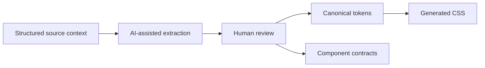

# Brand Design System Starter

> **Historical reference.** The active public context-to-design workflow now lives in [AI Context & Design System](https://github.com/silvermanjared-web/brand-context-system).

This repository is retained to preserve the earlier standalone implementation layer: design tokens, foundations, component guidance, CSS variables, and AI-assisted front-end handoff.

It is no longer the preferred entry point for the portfolio because the context and implementation layers have been combined into one end-to-end system.

## Why it remains public

The repository still demonstrates a useful earlier pattern:

- canonical design tokens;
- generated CSS variables;
- component-level implementation guidance;
- accessibility and foundation documentation;
- AI handoff instructions;
- deterministic structure validation.

## Current source of truth

Use [AI Context & Design System](https://github.com/silvermanjared-web/brand-context-system) for the active workflow:

```mermaid
flowchart LR
    Context[Structured source context] --> Extract[AI-assisted extraction]
    Extract --> Review[Human review]
    Review --> Tokens[Canonical tokens]
    Tokens --> CSS[Generated CSS]
    Review --> Components[Component contracts]
```

The combined repository now owns context, extraction, implementation, validation, governance, and handoff in one place.

## Related architecture

- [Growth Architecture OS](https://github.com/silvermanjared-web/growth-architecture-os)
- [AI Operating System Reference](https://github.com/silvermanjared-web/growth-architecture-os/tree/main/04-ai-systems/ai-operating-system-reference)
- [AI Context & Design System](https://github.com/silvermanjared-web/brand-context-system)

## IP and usage

This repository remains public for professional review and historical portfolio context. It is not licensed for commercial reuse, resale, model training, or derivative productization without permission.

See [USAGE.md](USAGE.md).